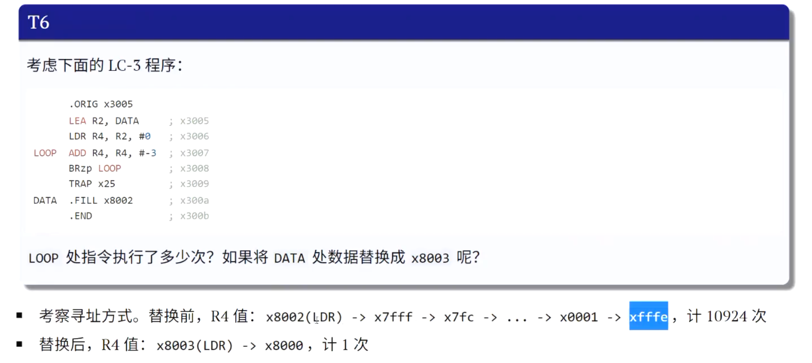

### LC-3

- `label` 会被替换为对应的地址，省去了 PC offset 的计算
- `LEA` 是直接赋值地址

### 栈

- 从上到下地址从低到高
- 入栈 top 指针上移

- 出栈序列问题
- 转化为括号匹配，左括号入栈，右括号出栈

### 队列

- front 指针下一个地址是队首元素，rear 指针指向队尾元素

### 状态机

- During：指令执行前，After：执行后

### 数据通路

