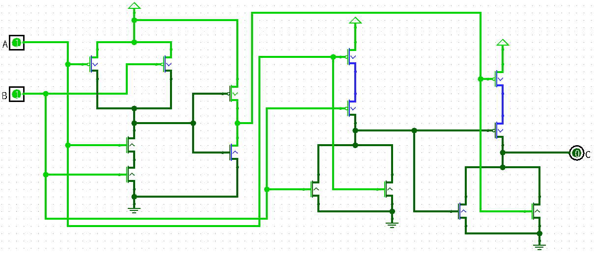
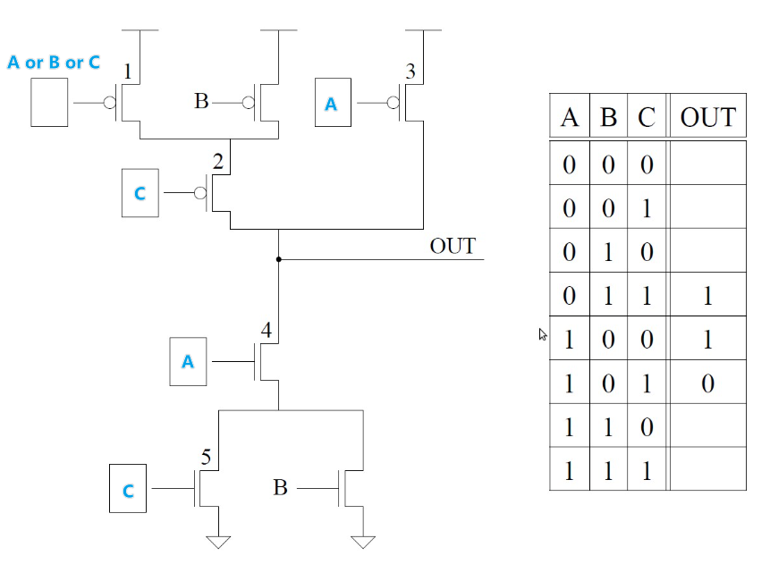
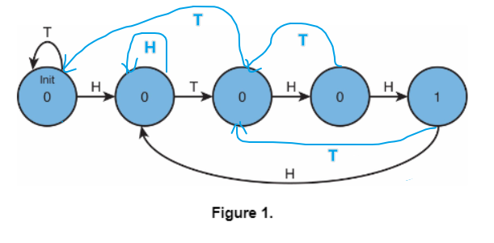
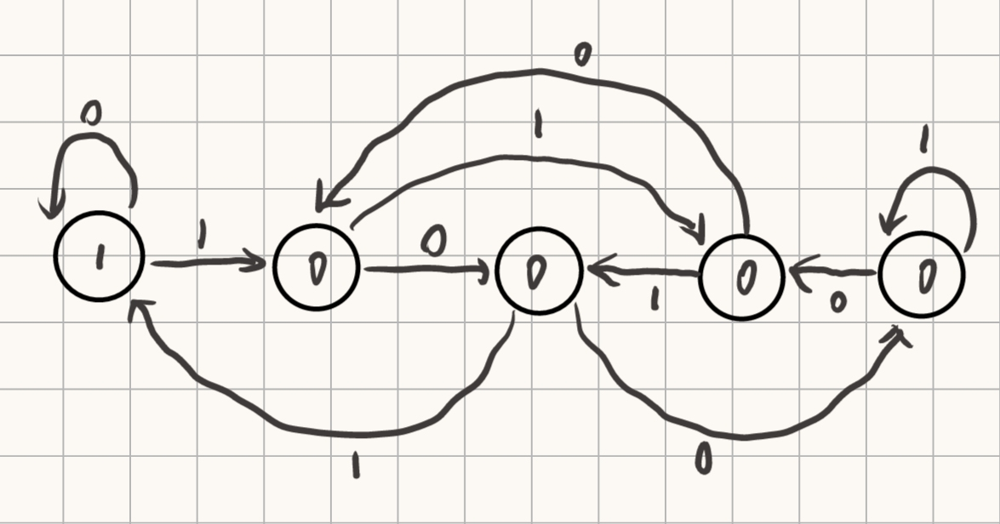

## 第二次作业

### T1

##### (a)

符号位为0，尾数为23位0，指数为00000001；实际有效数字为1，实际指数为 $1-127=-126$，所以最小规约正数为 $1\times2^{-126}$

##### (b)

非规格数指数为00000000，实际指数为 $-126$ ；尾数为23位1，隐藏的整数部分为0，所以实际尾数为 $0.11111...$，所以最大非规约数为 $0.1111...\times2^{-126}\approx1\times2^{-126}$

### T2

最高位符号位为0，剩下31位1，所以32位二进制补码能表示的最大正数为 $2^{31}-1$

### T3

异或运算逻辑表达式为 $C=\overline{A}B+A\overline{B}=\overline{AB+\overline{A}\ \overline{B}}=\overline{AB+\overline{A+B}}$，用一个与门，两个或非门即可实现，如下图：

> 上图为在logisim中画的，上面三角形的是power，下面三条杠的是ground

### T4

根据已知的真值表可以得到上面的电路，其中第一个框是不确定的，但不影响真值表，根据电路填出真值表如下：

| A    | B    | C    | OUT  |
| ---- | ---- | ---- | ---- |
| 0    | 0    | 0    | 1    |
| 0    | 0    | 1    | 1    |
| 0    | 1    | 0    | 1    |
| 0    | 1    | 1    | 1    |
| 1    | 0    | 0    | 1    |
| 1    | 0    | 1    | 0    |
| 1    | 1    | 0    | 0    |
| 1    | 1    | 1    | 0    |

### T5

- 0 OR X = X
- 1 OR X = 1
- 0 AND X = 0
- 1 AND X = X
- 0 XOR X = X

### T6

电路1为组合逻辑，设初始A,B均为0，当A为0时，D=C，当A为1时，D=B，A起选择作用；

电路2为时序逻辑，设初始A,B均为0，A,B中任意一个发生改变时D均会翻转，没有选择功能。

### T7

##### (a)

2^5^=32个输出

##### (b)

1bit 位的输出，16=2^4^，所以需要4bit位的选择信号

### T8

##### (a)

3个门延迟

##### (b)

逻辑表达式为 $z=ABCDE=((AB)(CD)E)$，有三个门延迟；若不限制与门的输入位数，那么可以用一个 5 输入与门完成。

### T9

**在时钟下降沿**，D1, D3, D5更新状态为~Q6, Q2, Q4，在时钟上升沿，D2, D4, D6更新状态为Q1, Q3, Q5，所以输出端一个周期的变化为 000000	(000000 100000	110000	111000	111100	111110	111111	011111	001111	000111	000011	000001)，第一次的上升沿状态没有变化，往后从第一个下降沿开始周期变化，变化间隔为半个周期。

所以 50 个周期后，变化了 $100-1=99$ 次，$99\%12=3$ 所以最终状态为 `111000`

6个周期后回到初始状态。

### T10

NAND真值表为

| A    | B    | C    |
| ---- | ---- | ---- |
| 0    | 0    | 1    |
| 0    | 1    | 1    |
| 1    | 0    | 1    |
| 1    | 1    | 0    |

对于任意的输入A与B，都有唯一的输出C，且输出C只与输入AB有关，所以逻辑完备。

### T11

##### (a)

##### (b)

共有 NULL	H	HT	HTH	HTHH 五种状态，所以需要三个状态变量

### T12

根据模5的余数分为5种状态，可画出状态机如下：

### T13

2^8^个内存位置，每个内存位置包含8字节。

$2^8\times8=2048\ Bytes$