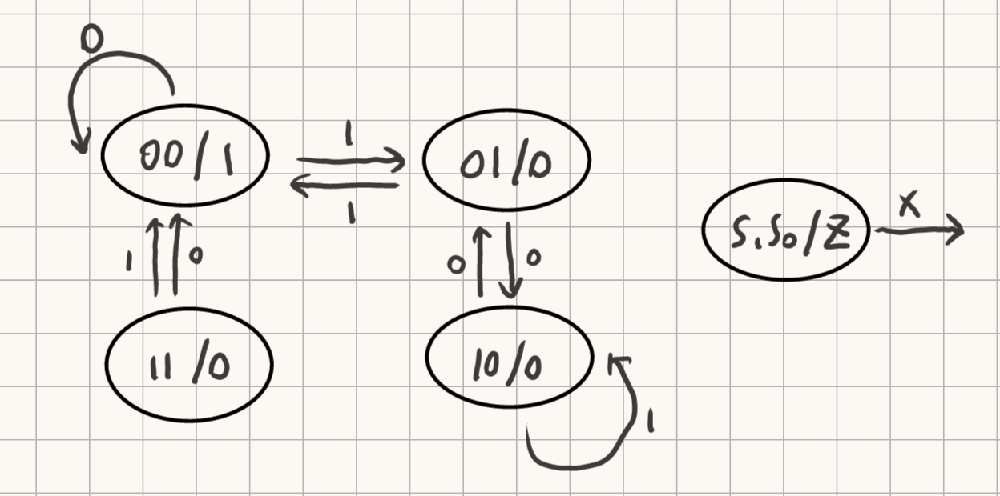

## 第三次作业

### T1

根据电路图，可以得到输出方程和状态转移方程如下：
$$
\begin{align}
&Z=\overline{S_1}\ \overline{S_0} \\
&S_1^{'}=\overline{S_1}S_0\overline{X}+S_1\overline{S_0}X \\
&S_0^{'}=\overline{S_1}\ \overline{S_0}X+S_1\overline{S_0}\ \overline{X}
\end{align}
$$

##### (a)

根据状态转移方程填写真值表如下：

| S~1~ | S~0~ | X    | Z    | S~1~^'^ | S~0~^'^ |
| ---- | ---- | ---- | ---- | ------- | ------- |
| 0    | 0    | 0    | 1    | 0       | 0       |
| 0    | 0    | 1    | 1    | 0       | 1       |
| 0    | 1    | 0    | 0    | 1       | 0       |
| 0    | 1    | 1    | 0    | 0       | 0       |
| 1    | 0    | 0    | 0    | 0       | 1       |
| 1    | 0    | 1    | 0    | 1       | 0       |
| 1    | 1    | 0    | 0    | 0       | 0       |
| 1    | 1    | 1    | 0    | 0       | 0       |

##### (b)

根据状态转移表画出有限状态机如下：

### T2

- 若上一步运算结果不是负数，跳转到 $x3032+7=x3039$ 地址的指令执行
- 若上一步运算结果是负数，则不做操作，PC自增，下次执行 $x3032$ 地址的指令

### T3

##### (a)

`Bits[15:12]` 代表操作码（做什么）

##### (b)

`Bits[11:0]` 表示操作数 （对谁操作）

### T4

1. 将 PC 内容装入 MAR ，PC自动增量，1个周期
2. 读内存，将数据装入 MDR，100个周期
3. 将 MDR 数据拷贝到 IR，1个周期
4. 译码，1个周期
5. 取操作数R2，R6进入 ALU，1个周期
6. 加法运算，结果放入R6，2个周期

所以共 106 个周期。

### T5

56 个操作码需要 6 bit，64 个寄存器需要 6 bit，所以还剩余 $32-6-6-6=14bit$，14 位的二进制补码表示范围为 $10000000000000-01111111111111$，即 $-2^{13}\rightarrow 2^{13}-1$

### T6

##### (a)

因为只有四个寄存器，所以只需两位即可表示，而总长度仍为16bit，所以剩余的bit更多了，对于 ADD(0001) 和 AND(0101)，当采用立即数时，可表示的范围变大了。

对于 NOT(1001)，由于剩余 bit 位都是 1，不携带信息，所以无影响。

##### (b)

LD(0010) 和 ST(0011) 都采用 PC相对寻址模式，剩余 bit 表示相对当前 PC 的偏移值，长度增加，所以可表示的范围也增大了。

##### (c)

对于跳转指令 BR(0000)，若需要跳转，那么采用 PC 相对寻址模式寻址，所以可跳转的范围也变大了。

### T7

|      | fetch instruction | decode | evaluate address | fetch data | execute | store result |
| ---- | ----------------- | ------ | ---------------- | ---------- | ------- | ------------ |
| PC   | ADD，STR，JMP     |        |                  |            | JMP     |              |
| IR   | ADD，STR，JMP     |        |                  |            |         |              |
| MAR  | ADD，STR，JMP     |        | STR，JMP         |            |         |              |
| MDR  | ADD，STR，JMP     |        |                  | STR，JMP   |         |              |

### T8

|        | 字线0 | 字线1 | 字线2 | 字线3 | D~out~ |
| ------ | ----- | ----- | ----- | ----- | ------ |
| cycle1 | 111   | 101   | 111   | 111   | 101    |
| cycle2 | 111   | 101   | 111   | 111   | 111    |
| cycle3 | 111   | 101   | 010   | 111   | 010    |
| cycle4 | 111   | 011   | 010   | 111   | 011    |
| cycle5 | 111   | 011   | 010   | 111   | 111    |
| cycle6 | 111   | 011   | 010   | 111   | 111    |
| cycle7 | 111   | 011   | 010   | 111   | 111    |
| cycle8 | 111   | 011   | 010   | 010   | 111    |

### T9

##### (a)

MDR：`00110000`

MAR：`001`

##### (b)

MDR：`00010101`

### T10

| R/W  | MAR   | MDR   |
| ---- | ----- | ----- |
| W    | x4000 | 11110 |
| R    | x4003 | 10110 |
| W    | x4001 | 10110 |
| R    | x4002 | 01101 |
| W    | x4003 | 01101 |

内存变化表：

|       | 第一次操作前 | 第三次操作后 | 第五次操作后 |
| ----- | ------------ | ------------ | ------------ |
| x4000 | 01101        | 11110        | 11110        |
| x4001 | 11010        | 10110        | 10110        |
| x4002 | 01101        | 01101        | 01101        |
| x4003 | 10110        | 10110        | 01101        |
| x4004 | 11110        | 11110        | 11110        |

### T11

##### (a)

225 个操作码，需要 8 bits 表示

##### (b)

120 个寄存器，需要 7 bits 表示

##### (c)

$32-8-7\times3=3\ bits$

### T12

##### (a)

$\frac{1}{2\times10^{-9}}=5\times10^8$

##### (b)

$\frac{5\times10^8}{8}=6.25\times10^7$

##### (c)

$\frac{1-2\times10^{-9}\times8}{2\times10^{-9}}+1\approx5\times10^8$

### T13

1. `FETCH`：取指令。从 PC 中取指令地址放入 MAR，PC自增。将 MAR 里的地址所存数据放入 MDR。将 MDR 所存数据放入 IR。
2. `DECODE`：译码。
3. `EVALUATE ADDRESS`：地址计算。基址偏移，PC 相对寻址...
4. `FETCH DATA`：获取操作数。从内存或寄存器获取。
5. `EXECUTE`：执行指令。AND，NOT...
6. `STORE RESULT`：存放结果。写入目的寄存器。

