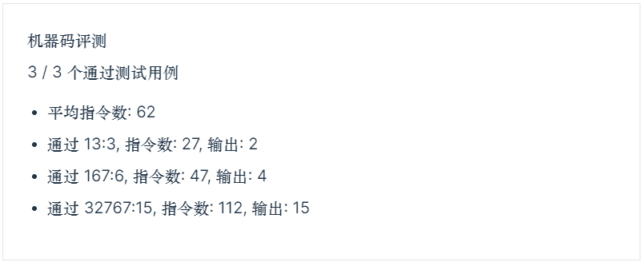

# ICS lab1

学号：PB21111715								 姓名：李宁						  日期：2022年11月7日

## 实验目的

1. 学习机器码编程
2. 熟练使用 LC-3 指令
3. 学习使用 LC3Tools 运行调试

## 实验原理

#### 实验题目

给定正数 A(x3100) 和 B(x3101)，计算在 A 的前 B bits 位（低位）中 1 的数量，结果存储在地址 x3102 中。要求程序从地址 x3000 开始

#### 思路分析

引入一个变量 C，初始是 `0000_0000_0000_0001`，与 A 相与即可判断 A 的第一个 bit 位是否为 1，如果结果为 1，则 sum++，否则 sum 不变，然后 C += C  实现左移一位，再与 A 相与，可判断 A 的第二位 是否为 1，......，如此循环 B 次即可，B可自减做循环的计数器。

## 实验步骤

### 代码

用 BR 指令控制循环

可写出代码如下：

```
0011 0000 0000 0000     ;程序入口
;准备工作
0010 000 011111111      ;把A放进R0		x3000
0101 001 001 1 00000    ;把R1清0		x3001
0001 001 001 1 00001    ;R1=1，用来判断1		x3002
0101 010 010 1 00000    ;把R2清0，存储结果		x3003
0010 011 011111100      ;把B放进R3		x3004
;循环起点
0000 110 000000110      ;判断B是否非正，是就跳出循环		x3005
0101 100 000 000 001    ;R1&R0放进R4		x3006
0000 010 000000001      ;判断是否为0，是0就跳过R2++的语句		x3007
0001 010 010 1 00001    ;R2++		x3008
0001 001 001 000 001    ;R1左移一位		x3009
0001 011 011 1 11111    ;R3--		x300a
0000 111 111111001     ;跳到循环起点		x300b
;存储结果
0011 010 011110101      ;存储结果		x300c
;结束程序
1111 0000 00100101		;HALT
```

## 实验结果

### 运行结果

样例输出结果正确，如下图：



## 实验总结

- 地址都是 16 进制数，计算偏移量别当成十进制算了
- 写代码前先写伪代码是好文明
- 善用 oj 和 lc3-tools
