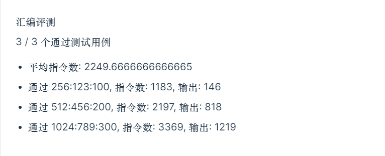
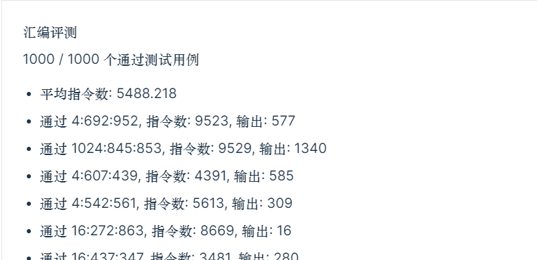

#   ICS lab2

学号：PB21111715								 姓名：李宁						  日期：2022年11月25日

## 实验目的

1. 学习汇编语言编程
2. 学习 lc3 指令的运用

## 实验原理

斐波那契数列具有递推公式如下：
$$
F(0)=F(1)=1\\
F(N)=F(N-2)\ \%\ p+F(N-1)\ \%\ q\\
$$

#### 递推求值

主要使用四个寄存器实现递推求值，赋值关系如下：
$$
R_3:F(N-1)\\
R_4:F(N-2)\\
R_5:F(N-1)\ \%\ q\\
R_7:F(N-2)\ \%\ p\\
$$
递推关系如下：
$$
R_4\leftarrow R_3\\
R_3\leftarrow R_5+R_7
$$
需要递推 N-1 次，用 $R_0$ 存储 N-1， 每次循环自减，BR 指令控制循环，直到 $R_0\leq0$

#### 取余方法

从上面可以看出，需要进行两个取余运算。

考虑对 $p$ 的取余，因为 $p=2^k$，具有良好的二进制性质，$p-1=2^k-1$ 具有 `00...1111..` 这样的形式，即前面若干位 0，后面全为 1，那么可以作为掩码使用，将 $F(N-2)$ 与 $p-1$ 相与即可得到余数，相当于把 $F(N-2)$ 的前若干位“抹去”，变为了 0，实际上就是一步减去了一个 $p$ 的倍数，剩下的部分比 $p$ 小，即所要求的余数。
$$
R_2\leftarrow p-1\\
R_7\leftarrow R_4\ \&\ R_2
$$
考虑对 $q$ 的取余，因为 $q$ 是一般的数字，没有特殊性质，所以只能通过减法实现求余。用 BR 指令控制循环，直到减到变成负数，然后再加回一个 $q$ 即可得到余数。
$$
R_1\leftarrow q\\
R_6\leftarrow -q\\
R_5\leftarrow R_3\\
R_5\leftarrow R_7+R_5（循环）\\
$$

## 实验步骤

### 代码

汇编代码如下：

```assembly
.ORIG x3000
LD R2, x00ff		;x3000 (R2 = p)
LD R1, x00ff		;x3001 (R1 = q)
LD R0, x00ff		;x3002 (R0 = N)
ADD R2, R2, #-1		;x3003 (R2 = p-1)
NOT R6, R1			;x3004
ADD R6, R6, #1		;x3005 (R6 = -q)
ADD R3, R3, #1		;x3006 (R3 = F(N-1))
ADD R4, R4, #1		;x3007 (R4 = F(N-2))
ADD R0, R0, #-1		;x3008 (R0 = N-1)
BRnz #8				;x3009 循环结束条件：R0 <= 0
ADD R5, R3, #0		;x300a (R5 = R3)
ADD R5, R6, R5		;x300b (R5 = R5 - q)
BRzp #-2			;x300c 循环结束条件：R5 < 0
ADD R5, R5, R1		;x300d 得到模 q 余数
AND R7, R4, R2		;x300e 得到模 p 余数
ADD R4, R3, #0		;x300f F(N-2) = F(N-1)
ADD R3, R5, R7		;x3010 F(N-1) = F(N-2) % p + F(N-1) % q
BRnzp #-10			;x3011 
ST R3, x00f0		;x3012 存储结果
TRAP x25
.END
```

### 测试数据

随机生成测试数据：

```c
#include <stdlib.h>
#include <stdio.h>
#include <time.h>
#include <math.h>
#define MAX 1000
int main()
{
    srand((unsigned)time(NULL));
    for (int i = 0; i < MAX; i++)
    {
        int k = rand() % 9 + 2;
        int p = pow(2, k);
        int q = rand() % 1015 + 10;
        int N = rand() % 1025;
        printf("%d:%d:%d", p, q, N);
        if (i != MAX - 1)
            printf(",");
    }
    system("pause");
}
```

## 实验结果

在自测网站上的结果：



自测样例：



## 实验总结

### 总结

小 tips:

- 对于 $2^k$ 的取余运算技巧
- 取反加一得到相反数
- 减法实现求余，减到负数再加回来
- 循环实现递推运算

如何提高循环效率？

- 循环中放尽量少的语句，不必要的尽量放外面
- 循环终止条件放在开头，避免多执行一次不必要的循环

### 思考题

当 (p, q) 取某些特定值时数列为循环数列，例如 (32, 16)，(64,32)。

1. 最小正周期：不会
