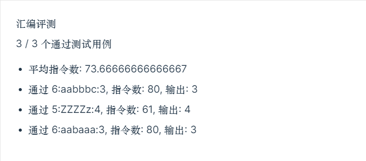
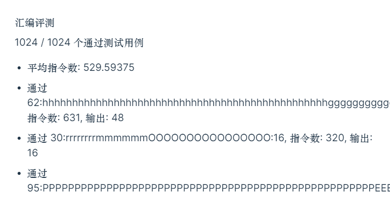

#   ICS lab3

学号：PB21111715								 姓名：李宁						  日期：2022年11月29日

## 实验目的

1. 学习汇编语言
2. 熟练使用 lc3 指令
3. 了解计算机系统

## 实验原理

用 R0 存储字符串长度 N，R1 存储 S 中字符的地址，R2 存储最长叠子串长度，R3 存储当前所扫描到的叠子串字符，R4 存储当前叠子串长度，R5 存储下一个将要扫描的字符。

R0 自减作为循环结束条件，R1 自增扫描下一个字符，判断是否与当前叠子串字符相同（相减判断是否为 0），若相同，则 R4++；否则更新当前叠子串字符，判断 R4 与 R2 的大小，若 R4 > R2，则更新 R4 为 R2，R4 清零。

字符串 S 扫描完之后再判断 R4 和 R2 大小关系，存储较大者到 x3050

## 实验过程

汇编代码如下：

```assembly
.ORIG x3000
LDI R0, NUM		;存储字符串长度
LD R1, DATA		;指向下一个要扫描的字符的地址
;初始化
ADD R2, R2, #1		;R2=1
LDR R3, R1, #0		;R3=M[R1]
ADD R4, R4, #1		;R4=1
;循环
AGAIN ADD R0, R0, #-1		;剩余字符个数--
BRnz SKIP	;循环出口
ADD R1, R1, #1	;指针后移
LDR R5, R1, #0	;获取当前字符
;比较当前字符与上一个字符
NOT R6, R5
ADD R6, R6, #1	;R6=-R5
ADD R6, R6, R3
BRz SKIP1	;跳过
;判断R4与R2大小
NOT R6, R4
ADD R6, R6, #1	;R6=-R4
ADD R6, R6, R2
BRzp SKIP2
;更新最长长度
AND R2, R2, #0
ADD R2, R2, R4	;R2=R4
;更新当前叠子串字符
SKIP2 AND R3, R3, #0
ADD R3, R3, R5	;R3=R5
AND R4, R4, #0	;当前长度清零
SKIP1 ADD R4, R4, #1		;当前长度++
BRnzp AGAIN		;回到循环起点
;循环结束，判断是否更新R2
SKIP  NOT R6, R4
ADD R6, R6, #1	;R6=-R4
ADD R6, R6, R2
BRzp THEND
;更新最长长度
AND R2, R2, #0	;R2=0
ADD R2, R2, R4	;R2=R4
;存储结果
THEND STI R2, RESULT
HALT
RESULT .FILL x3050
NUM .FILL x3100
DATA .FILL x3101
.END
```

## 实验结果

##### 测评结果：



##### 自测结果：



## 实验总结

- 使用 Label 来方便跳转或者访问内存
- 先写伪代码，再翻译成汇编
- 第一个数据没必要单独处理，放进循环里可以减少代码量
- 结果不对不一定是汇编写错了，也可能是生成数据的 C 写错了🤣
