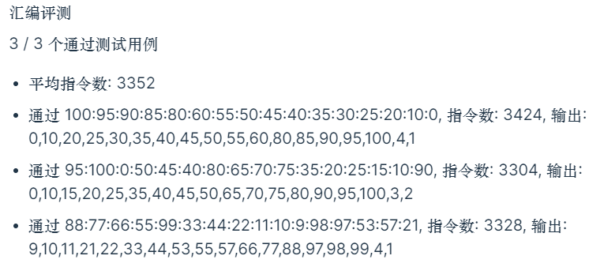
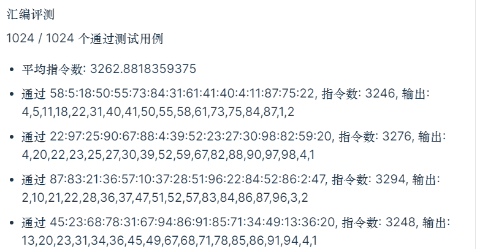

#   ICS lab4

学号：PB21111715								 姓名：李宁						  日期：2022年12月1日

## 实验目的

1. 学习汇编语言
2. 熟练使用 lc3 指令
3. 了解计算机系统

## 实验原理

##### 选择排序：

用 R0 作为指向原数组的指针(x4000)，R1 作为指向排序后数组的指针(x5000)，R2 存储当前最小值，R3 存储选择下界，R4 存储当前数字。R5 控制原数组的扫描结束，R6 记录已排序个数。

循环扫描原数组，在大于 R3 的情况下，判断 R4 是否小于 R2，若小于，更新 R2，否则直接扫描下一个；扫描一遍后存储 R2 的值到排序后的数组地址中，回到原数组起点再次扫描，直至排序后的数组已满。（这里是通过设置下界来判断某个元素是否被取到过，但前提是数组中没有重复元素，否则会只能取该元素一次）

##### 计算AB个数：

扫描排序后的数组，依然用 R1 作为指针，R1 - 1 就是最后一个元素的位置，也即最高成绩。R2 存储 A 的个数， R3 存储 A+B 的个数，R4 存储当前成绩，R5 存储常量 -85， R6 存储常量 -75。

向前扫描 4 位或者碰到成绩小于 85 的结束 A 的计算，开始 B 的计算；继续向前扫描至 8 位或者碰到成绩小于 75 的结束 B 的计算。

## 实验过程

##### 汇编代码：

```assembly
.ORIG x3000
LD R6, COUNT	;剩余未排序个数
ADD R3, R3, #-1	;下界设为-1
LD R1, ANS		;指向排序后数组的指针
;初始化
AGAIN LD R0, ARRAY	;指向原数组的指针
LD R2, MAX		;最小值设为100 
LD R5, COUNT	;剩余未扫描个数
;扫描原数组
SUBAGAIN LDR R4, R0, #0		;R4=M[R0]
ADD R0, R0, #1	;R0++
;判断是否取过
AND R7, R7, #0
NOT R7, R3
ADD R7, R7, #1
ADD R7, R4, R7	;R7=R4-R3
BRnz SKIP
;判断是否小于最小值
AND R7, R7, #0
NOT R7, R2
ADD R7, R7, #1
ADD R7, R4, R7	;R7=R4-R2
BRzp SKIP
;更新最小值
AND R2, R2, #0
ADD R2, R2, R4
SKIP ADD R5, R5, #-1
BRp SUBAGAIN
;存储最小值，更新下界
STR R2, R1, #0	;M[R1]=R2
ADD R1, R1, #1	;R1++
AND R3, R3, #0
ADD R3, R3, R2	;R3=R2
ADD R6, R6, #-1	;R6--
BRp AGAIN
;计算A的个数
LD R5, ACONST	;R5= -85
LD R6, BCONST	;R6= -75
AND R2, R2, #0
AND R3, R3, #0
AGAIN1 ADD R1, R1, #-1	;R1--
LDR R4, R1, #0	;R4=M[R1]
ADD R7, R4, R5
BRn SKIP1
ADD R2, R2, #1	;R2++
ADD R7, R2, #-4	;判断优秀率是否超了
BRzp SKIP2
BRnzp AGAIN1
;计算B的个数，同理
SKIP1 ADD R1, R1, #1
SKIP2 ADD R3, R3, R2; 
SKIP3 ADD R1, R1, #-1
LDR R4, R1, #0
ADD R7, R4, R6
BRn THEND
ADD R3, R3, #1
ADD R7, R3, #-8
BRzp THEND
BRnzp SKIP3
;存储结果
THEND NOT R7, R2
ADD R7, R7, #1
ADD R3, R3, R7; 
STI R2, NUMA
STI R3, NUMB
HALT
;占位
ARRAY .FILL x4000
ANS .FILL x5000
NUMA .FILL x5100
NUMB .FILL x5101
MAX .FILL #100
COUNT .FILL #16
ACONST .FILL #-85
BCONST .FILL #-75
.END
```

## 实验结果

##### 测评结果：



##### 自测结果：



## 实验总结

- 还是先写伪代码，有了大框架再开写
- 善用 Label 和 BR 指令可以很方便的控制循环跳转，或跳过分支语句
- 注意指令的执行顺序，尤其是在跳转比较多的程序中，很容易因为顺序不对而达不到预期效果
