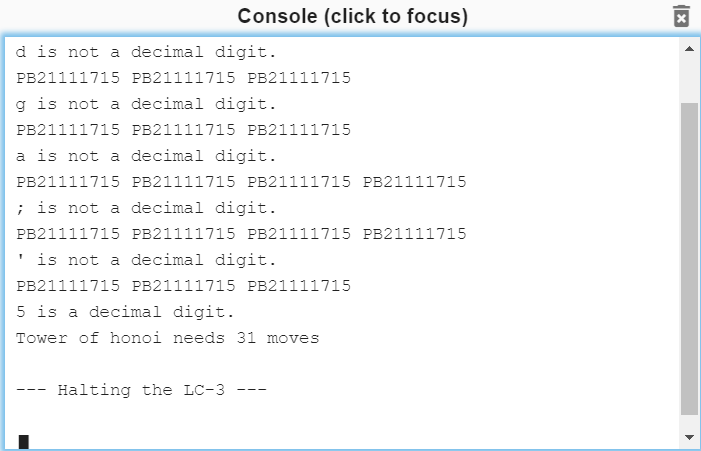

# ICS lab5

学号：PB21111715							姓名：李宁							日期：2022年12月15日

## 思路

#### 用户程序

循环实现重复输出学号字符串，每次输出前检验 N 是否是有效值。若 N 是有效值，则调用 HONOI 子程序，输出结果，HALT；否则继续输出学号

输出结果比较麻烦，需要把一个数拆分为十进制形式的各位，然后依次以 ascii 码形式输出，这里直接使用减法实现求模，减了多少次就是求模的结果(注意要减到负数，再加回来，之前实验已经见过了)，因为 $0\leq N\leq 9$，所以最大的结果是 511，最多只用求模 3 次(~~既然知道结果就那10个，为什么不打表呢~~) ，最后输出结果时还要转为 ascii 码传递给 DDR

调用 HONOI 子程序就直接 JSR 指令，这里子程序是把运算结果放在 R0，把 N 的值放在 R1，所以 R0 属于 caller-save，R1 在子程序中自减，属于 callee-save，但由于原程序 R0 R1 是没用的，所以我这里就不备份了

#### 子程序

HONOI 子程序：根据递推公式 $f(n)=2f(n-1)+1$，又有 $f(0)=0$，直接计算即可，我这里是直接从下向上计算，比递归效率高，最后结果放在 R0 中作为返回值

> 更正：题目要求递归，已改为递归实现，将每层的返回地址（即R7）压入用户栈，在返回前弹出栈顶元素即可返回到正确的地址。

还有一个小的延迟子程序，用于减缓输出速度，很简单，通过计数延迟即可

#### 中断服务程序

首先是备份接下来要用的寄存器的值。然后因为此服务程序已经被加入到陷入矢量表中，所以只要有键盘输入，系统就会调用此程序。我们需要做的就是读取键盘输入，判断是否合法，进行相应的响应即可。

读取键盘输入很简单，直接读 KBDR；然后利用 ascii 码的范围来判断输入的合法性，合法输入的 ascii 码范围是 48-57，即 0-9 的 ascii 码表示，通过与 -48 或 -57 相加来判断大小关系；最后是进行响应，有两种响应，在非法输入时(对应ERROR)，输出 `"<the input character> is not a decimal digit."`，在合法输入时(对应RIGHT)，输出 `"<the input character> is not a decimal digit."`，然后保存 N 的值到内存中相应位置。注意到两个提示信息的一致性，回显键盘输入+一个字符串，所以可以只用一段代码，减少代码量。

最后手动恢复原寄存器内容。RTI 自动恢复状态寄存器内容，被中断的程序继续以原状态运行。

## 代码

> 更正：改用 Trap x20, Trap x21 和 Trap x22 进行 I/O ，不直接对设备寄存器操作
>
> 减少了很多代码量，方便快捷，函数封装 YYDS !

### 用户程序

```assembly
;用户程序，不断输出学号，直到N为有效值（非xFFFF），停止输出，调用HONOI，输出结果
        .ORIG x3000
Loop    LDI R1, HONOI_N
        ADD R2, R1, #1
        BRz SKIP
        LD R6, R6INIT
        ;输出"Tower of honoi needs "
        LEA R0, String1
        Trap x22
        JSR HONOI	;N为有效值，调用HONOI子程序
        ;输出计算结果，分别求出各位的数字，再转为ascii码输出
        LD R3, Const1
        ADD R2, R0, #0  ;结果由R0转存至R2
        ADD R0, R2, R3
        BRn SKIP1
        AND R0, R0, #0
        LD R4, ASCII
AGAIN1  ADD R0, R0, #1  ;减法求余
        ADD R2, R2, R3
        BRzp AGAIN1
        LD R3, Const2
        ADD R2, R2, R3
        ADD R0, R0, #-1
        ADD R0, R0, R4
        Trap x21;百位
SKIP1   ADD R0, R2, #-10
        BRn SKIP2
        AND R0, R0, #0
AGAIN2  ADD R0, R0, #1
        ADD R2, R2, #-10
        BRzp AGAIN2
        ADD R2, R2, #10
        ADD R0, R0, #-1
        ADD R0, R0, R4
        Trap x21;十位
SKIP2   ADD R0, R2, R4
        Trap x21;个位
        ;输出" moves."
        LEA R0, String2
        Trap x22
        HALT    ;结束程序
	   ;循环输出学号
SKIP    LEA R0, Prompt
        Trap x22
        JSR DELAY	;延迟输出
        BRnzp Loop
```

### HONOI 子程序

```assembly
;HONOI子程序，R1为参数，计算并返回结果R0
HONOI   ADD R6, R6, #-1
        STR R7, R6, #0
        ADD R1, R1, #-1
        BRzp REC
        ; if(n=0) return 0
        AND R0, R0, #0
        LDR R7, R6, #0
        ADD R6, R6, #1
        RET
        ; else return 2*f(n-1)+1
REC     JSR HONOI
        ADD R0, R0, R0
        ADD R0, R0, #1
        LDR R7, R6, #0
        ADD R6, R6, #1
        RET
```

### 中断服务程序

```assembly
;中断服务程序，检测N的合法性，最终存储N
        .ORIG x1000
        ST R0, Save0
        ST R1, Save1
        ST R2, Save2
        LD R1, Newline
        ADD R0, R1, #0
        Trap x21	;输出换行符
        Trap x20
        Trap x21    ;回显输入字符
        LD R2, MIN
        ADD R2, R0, R2
        BRn ERROR	;N<0
        LD R2, MAX
        ADD R2, R0, R2
        BRp ERROR	;N>9
        ;保存N值
        LD R2, MIN
        ADD R0, R0, R2 
        STI R0, NSTP
        LEA R0, Str2
        BRnzp Loop1
ERROR   LEA R0, Str1
        ;输出提示信息
Loop1   Trap x22
        ;输出换行符
        ADD R0, R1, #0
        Trap x21
        ST R0, Save0
        ST R1, Save1
        ST R2, Save2
        RTI
```

## 运行结果

> And how do you design your own test cases to ensure the program works fine?

0 到 9 均经过测试，样例输出如下：



## 总结

- 熟悉了 LC3 的 I/O 处理
- 弄懂了中断驱动的 I/O
- 熟悉了子程序的使用和递归实现
- 学会了使用 LC3-tools

> 一个小实验改了三版，累死了，建议实验文档写清晰点🙌
