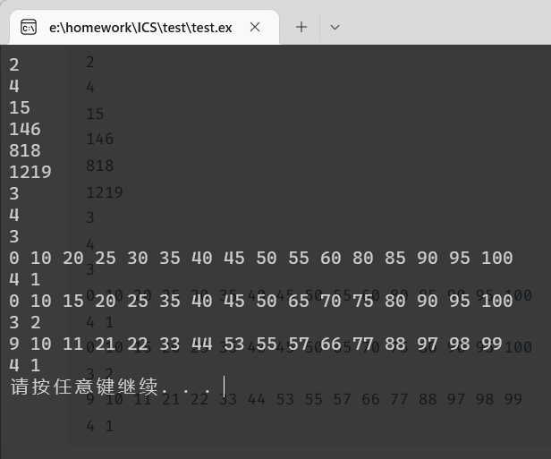

# ICS lab6

学号：PB21111715							姓名：李宁					日期：2022年12月28日

## 实验目的

- 使用高级语言编程
- 体会高级语言与汇编的关系
- 回顾之前的 lab 内容

## 实验原理

#### lab1

> counting how many 1

设置变量 `mask` 为掩码，只有一位为 1，其他位为 0，和 `a` 相与即可判断该位是否为 1，若相与结果不为 0，则为 1，否则为 0，从低到高判断 `b` 次即可，掩码左移得到新的掩码，左移使用 `mask += mask` 实现，`b--` 控制循环的结束。 

具体代码如下：

```cpp
int16_t lab1(int16_t a, int16_t b) {
    int16_t mask = 1, ans = 0;  //初始化
    while (b) {     //计算 1 的个数
        if (mask & a)
            ans++;
        mask += mask;
        b--;
    }
    return ans; //返回结果
}
```

#### lab2

> a variant of the fibonacci sequence

设置变量 `fn` 存储 f(n)，`fn_1` 存储 f(n-1)，初始化 `fn = fn_1 = 1`，后面每次迭代都将结果存储在 `fn` 中，然后 `fn` 原来的值进入 `fn_1`；

递推公式的第一项 `f(n-2)%p` 直接 `fn_1 & (p-1)` 得到，利用了 $p=2^k$ 的性质；第二项 `f(n-1)%q` 递减求余得到，注意减到小于零，再加回一次。

具体代码如下：

```cpp
int16_t lab2(int16_t p, int16_t q, int16_t n) {
    int16_t fn = 1, fn_1 = 1;   //初始化
    n--;
    while (n) { //递推计算
        int16_t tmp = 0;
        tmp += fn_1 & (p - 1);  //掩码求余
        int16_t back = fn;
        while (back >= 0)   //递减求余
            back -= q;
        back += q;
        tmp += back;
        fn_1 = fn;  //更新状态
        fn = tmp;
        n--;
    }
    return fn;  //返回结果
}
```

#### lab3

> longest duplicate substring

用变量 `ans` 标记现有最大重复子串长度，`cur_len` 表示当前重复子串长度，`cur_char` 表示当前重复字符，扫描字符串，不断更新这些变量即可。

注意最后再更新一次，因为代码中触发更新 `ans` 的条件是遇到了不同的字符，所以最后一个重复子串的长度未与 `ans` 比较过。

代码如下：

```cpp
int16_t lab3(int16_t n, char s[]) {
    int16_t ans = 0, cur_len = 1, cur_char = s[0];  //初始化
    for (int i = 1; i < n; ++i) {   //扫描字符串
        if (s[i] == cur_char)   //相等长度++
            cur_len++;
        else {
            if (cur_len > ans)  //更新最新长度
                ans = cur_len;
            cur_char = s[i];    //更新现在比较的字符
            cur_len = 1;
        }
    }
    if (cur_len > ans)  //最后再更新一次最大长度
        ans = cur_len;
    return ans; //返回结果
}
```

#### lab4

> sort and count

先选择排序，每次选择最小的，向前插，设置变量 `cur_min` 表示当前最小值，`cur_pos` 表示当前最小值的下标，两重循环即可得到升序的 `score[]` 数组。

然后从后向前扫描排序后的数组，因为 A+B 最多 8 个，所以扫描的下标范围为 15-7，如果 `score[i] >= 85 && i > 11`，则符合 A 的条件，`(*a)++`，否则若 `score[i] >= 75`，则符合 B 的条件，`(*b)++`。注意 a 与 b 在使用前要清零。

代码如下：

```cpp
int16_t lab4(int16_t score[], int16_t *a, int16_t *b) {
    //选择排序，每次找到最小的换到前面
    for (int i = 0; i < 16; ++i) {
        int16_t cur_min = score[i], cur_pos = i;
        for (int j = i + 1; j < 16; ++j) {
            if (score[j] < cur_min) {
                cur_min = score[j];
                cur_pos = j;
            }
        }
        int16_t tmp = score[i];
        score[i] = cur_min;
        score[cur_pos] = tmp;
    }
    //从后向前扫描已排序的score数组，计算AB个数
    *a = *b = 0;
    for (int i = 15; i > 7; --i) {
        if (score[i] >= 85 && i > 11)
            (*a)++;
        else if (score[i] >= 75)
            (*b)++;
        else
            break;
    }
    return 1;
}
```

## 实验过程

#### 遇到的bug

- 递减求余写成了递减求商
- 最后忘记更新最长长度
- a b 忘记清零
- `*(a)++`而不是`*a++`

## 实验结果

测试样例全部通过，如下图所示：



## 思考题

> What is the difference between programming in a high-level language and
> programming in LC3 assembly language?

高级语言明显更方便，扩展性更好，写起来舒服，读起来易懂；汇编语言更基础，更本质，但写起来不方便，有很多基础操作还要自己手搓

> What instructions do you think need to be added to LC3? 
>
> Hint: You can think about the previous labs and what instructions could be added to greatly simplify the previous programming)

减法指令，虽然可以用 `ADD` 和 `NOT` 几句话实现，但减法实在用的太多了，如果有减法指令，肯定能大大简化代码量；

或者是取余指令，可以大大减少 lab2 的工作量

> Is there anything you need to learn from LC3 for the high-level language you use?

学到了计算机系统的设计思想，以及程序在系统上如何运作，数据通路，内存读写等基本原理。