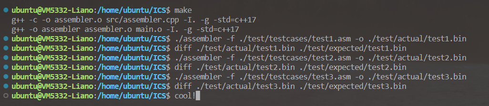

# ICS labA

学号：PB21111715								姓名：李宁							日期：2022年12月31日

## 实验目的

- 学习汇编器原理
- 复习 lc3 指令
- 学习 cpp 知识

## 实验原理

### 汇编原理

两次扫描实现将汇编代码转为机器码。第一次扫描：按行处理，先格式化指令代码，不同部分用空格分隔，去除首尾空格，再把 `label` 及其对应地址放入 `label_map` 后，删除`label` 得到格式化的 `command`；获取指令第一部分判断指令类型，将 `command` 和对应的`current_address` ， `CommandType` 放入指令容器，再根据指令更新 `current_address`；第二遍扫描：根据格式化的 `commands` 翻译为机器码，`label` 通过 `label_map` 和 `current_address` 计算偏移量，其他的直接按照对应指令类型和格式翻译为机器码。

### 代码细节

#### assembler.h

首先是 `assembler` 类，包含有以下部分：

成员变量：

- `label_map` ：存储标签及其所指地址
- `commands` ：指令容器

成员函数：

- `TranslatePseudo` ：翻译伪操作指令
- `TranslateCommand` ：翻译操作指令
- `TranslateOprand` ：翻译操作对象(立即数 or 寄存器)
- `LineLabelSplit` ：处理标签
- `firstPass` ：第一遍扫描
- `secondPass` ：第二遍扫描
- `assemble` ：主体函数

然后是一些基础处理函数，这里只分析我填的那些，其他的也很基础。

###### Trim

去除首尾空白的 `Trim` 函数：第一个非空格字符前和最后一个非空格字符后擦除即可，代码如下：

```cpp
// 去除首尾空白
static inline std::string &Trim(std::string &s) {
    if (s.empty())
        return s;
    s.erase(0, s.find_first_not_of(" "));
    s.erase(s.find_last_not_of(" ") + 1);
    return s;
}
```

###### FormatLine

格式化指令的 `FormatLine` 函数：去除注释直接擦除字符 ';' 之后的字符即可；遍历一遍即可实现小写转大写，逗号转空格；最后调用 `Trim` 函数去除首尾空格，代码如下：

```cpp
// 格式化一行指令
static std::string FormatLine(const std::string &line) {
    std::string ans = line;
    if (ans.empty())
        return ans;
    // 去除注释
    if (ans.find_first_of(";") != std::string::npos)
        ans.erase(ans.find_first_of(";"));
    for (int i = 0; i < ans.size(); ++i) {
        // 小写转大写
        if (ans[i] >= 'a' && ans[i] <= 'z')
            ans[i] += 'A' - 'a';
        // 逗号转空格
        else if (ans[i] == ',')
            ans[i] = ' ';
        // 转义字符转空格
        else if (ans[i] == '\t' || ans[i] == '\n' || ans[i] == '\r' || ans[i] == '\f' || ans[i] == '\v')
            ans[i] = ' ';
    }
    // 去除首尾空格
    return Trim(ans);
}
```

###### NumberToAssemble

识别字符串中的数字转为二进制字符串的 `NumberToAssemble` 函数：首先识别字符串中的数字，转为 int 型（`RecognizeNumberValue` 函数），然后将 int 型数字转为 16 位二进制字符串（需要包含 \<bitset\> 头文件），代码如下：

```cpp
// 识别 string 中的数字转为 int
static int RecognizeNumberValue(const std::string &str) {
    // 十进制
    if (str[0] == '#')
        return stoi(str.substr(1));
    // 十六进制
    else if (str[0] == 'X' || str[0] == 'x')
        return stoi(str.substr(1), NULL, 16);
    else
        return -1;
}
// int 转为二进制 string
static std::string NumberToAssemble(const int &number) {
    std::bitset<16> bit(number);
    return bit.to_string();
}
// string 转为二进制 string
static std::string NumberToAssemble(const std::string &number) {
    return NumberToAssemble(RecognizeNumberValue(number));
}
```

###### ConvertBin2Hex

二进制串转为十六进制串的 `ConvertBin2Hex` 函数：首先补位至 4 的倍数，然后每四位一转化即可，代码如下：（其实只能用到 16 位二进制串转为 4 位十六进制串）

```cpp
// 二进制 string 转为十六进制
static std::string ConvertBin2Hex(const std::string &bin) {
    std::string tmp = bin;
    // 补位
    if (tmp.size() % 4 == 1)
        tmp = "000" + tmp;
    else if (tmp.size() % 4 == 2)
        tmp = "00" + tmp;
    else if (tmp.size() % 4 == 3)
        tmp = "0" + tmp;
    std::string ans;
    // 四位一转
    for (int i = 0; i < tmp.size(); i = i + 4) {
        std::string subtmp = tmp.substr(i, 4);
        int v = 0, w = 1;
        for (int j = 3; j >= 0; --j) {
            v += (subtmp[j] - '0') * w;
            w *= 2;
        }
        char c;
        if (v < 10)
            c = v + '0';
        else
            c = v - 10 + 'A';
        ans += c;
    }
    return ans;
}
```

#### assembler.cpp

##### firstPass

这里只列出一些主要的函数。

###### LineLabelSplit

处理 label 的 `LineLabelSplit` 函数：首先判断是否是 label，如果是，那么先加入 `label_map`，然后删去 label

代码如下：

```cpp
// 处理 label
std::string assembler::LineLabelSplit(const std::string &line, int current_address) {
    auto first_whitespace_position = line.find(' ');
    auto first_token = line.substr(0, first_whitespace_position);
    // 是 label
    if (IsLC3Pseudo(first_token) == -1 && IsLC3Command(first_token) == -1 && IsLC3TrapRoutine(first_token) == -1) {
        // 添加至 label_map
        label_map.AddLabel(first_token, current_address);
        // 删去 label
        if (first_whitespace_position == std::string::npos) {
            return "";
        }
        auto command = line.substr(first_whitespace_position + 1);
        return Trim(command);
    }
    return line;
}
```

第一遍扫描的主体函数：按行处理，先格式化，然后处理 label，最后将指令地址，内容和类型放入 `commands` 中，主要工作是 `current_address` 的更新，代码如下：

```cpp
// 第一遍扫描，保存指令和 label 地址
int assembler::firstPass(std::string &input_filename) {
    std::string line;
    std::ifstream input_file(input_filename);
    if (!input_file.is_open()) {
        std::cout << "Unable to open file" << std::endl;
        // @ Input file read error
        return -1;
    }
    int orig_address = -1;
    int current_address = -1;
    // 按行处理
    while (std::getline(input_file, line)) {
        line = FormatLine(line);
        if (line.empty())
            continue;
        auto command = LineLabelSplit(line, current_address);
        if (command.empty())
            continue;
        // 获取指令类型
        auto first_whitespace_position = command.find(' ');
        auto first_token = command.substr(0, first_whitespace_position);
        // 特判 .ORIG and .END
        if (first_token == ".ORIG") {
            std::string orig_value = command.substr(first_whitespace_position + 1);
            orig_address = RecognizeNumberValue(orig_value);
            if (orig_address == std::numeric_limits<int>::max()) {
                // @ Error address
                return -2;
            }
            current_address = orig_address;
            continue;
        }
        if (orig_address == -1) {
            // @ Error Program begins before .ORIG
            return -3;
        }
        if (first_token == ".END") {
            break;
        }
        // 根据指令内容修改当前地址
        // 操作指令
        if (IsLC3Command(first_token) != -1 || IsLC3TrapRoutine(first_token) != -1) {
            commands.push_back({current_address, command, CommandType::OPERATION});
            current_address += 1;
            continue;
        }
        // 伪操作
        commands.push_back({current_address, command, CommandType::PSEUDO});
        auto operand = command.substr(first_whitespace_position + 1);
        if (first_token == ".FILL") {
            auto num_temp = RecognizeNumberValue(operand);
            if (num_temp == std::numeric_limits<int>::max()) {
                // @ Error Invalid Number input @ FILL
                return -4;
            }
            if (num_temp > 65535 || num_temp < -65536) {
                // @ Error Too large or too small value  @ FILL
                return -5;
            }
            current_address += 1;
        }
        if (first_token == ".BLKW") {
            int num_temp = RecognizeNumberValue(operand);
            current_address += num_temp;
        }
        if (first_token == ".STRINGZ") {
            current_address += (command.find_last_of("\"") - command.find_first_of("\""));
        }
    }
    // OK flag
    return 0;
}
```


##### secondPass

###### TranslateOprand

翻译操作对象的 `TranslateOprand` 函数：首先去除首尾空白；操作对象有三种，label，寄存器或立即数，在 `label_map` 中查找即可判断是否是 label，判断首字符是否是 'R' 即可判断是否是寄存器，否则就是立即数；如果是 label，那么需要计算 offset，否则直接读取数字即可。

代码如下：

```cpp
// 翻译操作对象
std::string assembler::TranslateOprand(unsigned int current_address, std::string str, int opcode_length) {
    // 去除首尾空白
    str = Trim(str);
    auto item = label_map.GetAddress(str);
    // 是 label
    if (item != -1) {
        int offset = item - current_address - 1;
        std::string tmp = NumberToAssemble(offset);
        return tmp.substr(16 - opcode_length);
    }
    // 是寄存器
    if (str[0] == 'R') {
        std::string tmp = NumberToAssemble(str[1] - '0');
        return tmp.substr(13);
    }
    // 是立即数
    else {
        std::string tmp = NumberToAssemble(str);
        return tmp.substr(16 - opcode_length);
    }
}
```

###### TranslatePseudo

翻译伪操作的 `TranslatePseudo` 函数：三种类型，.FILL 就识别后面的数，转为 16 位二进制串返回；.BLKW 就用 16 位二进制 0 占位，后面的数决定占位几个，每个之间用 '\\n' 分隔；.STRINGZ 就用后面的字符串占位，每个字符用 16bit ascii 码表示，字符之间用 '\\n' 分隔。

代码如下：

```cpp
// 翻译伪操作
std::string assembler::TranslatePseudo(std::stringstream &command_stream) {
    std::string pseudo_opcode;
    std::string output_line;
    command_stream >> pseudo_opcode;
    // .FILL
    if (pseudo_opcode == ".FILL") {
        // 填充 .FILL 后面的值
        std::string number_str;
        command_stream >> number_str;
        output_line = NumberToAssemble(number_str);
        if (gIsHexMode)
            output_line = ConvertBin2Hex(output_line);
    }
    // .BLKW
    else if (pseudo_opcode == ".BLKW") {
        // 填充 0
        std::string number_str;
        command_stream >> number_str;
        int num = RecognizeNumberValue(number_str);
        std::string temp = NumberToAssemble(0);
        if (gIsHexMode)
            temp = ConvertBin2Hex(output_line);
        output_line = temp;
        // 填充个数由 .BLKW 后面的值决定
        while (--num)
            output_line += "\n" + temp;
    }
    else if (pseudo_opcode == ".STRINGZ") {
        // 填充 .STRINGZ 后面的字符串
        std::string str;
        command_stream >> str;
        str = str.substr(str.find_first_of("\"") + 1, str.find_last_of("\"") - str.find_first_of("\"") - 1);
        for (int i = 0; i <= str.size(); ++i) {
            output_line += NumberToAssemble(str[i]);
            if (i < str.size())
                output_line += "\n";
        }
    }
    return output_line;
}
```

###### TranslateCommand

翻译操作指令的 `TranslateCommand` 函数：根据 `command_tag` 翻译操作码，然后调用 `TranslateOprand` 翻译操作对象，代码部分如下：

```cpp
// 翻译操作指令
std::string assembler::TranslateCommand(std::stringstream &command_stream, unsigned int current_address) {
    // 获取指令编号
    std::string opcode;
    command_stream >> opcode;
    auto command_tag = IsLC3Command(opcode);
    // 获取操作对象
    std::vector<std::string> operand_list;
    std::string operand;
    while (command_stream >> operand)
        operand_list.push_back(operand);
    auto operand_list_size = operand_list.size();
    std::string output_line;
    // Trap 指令
    if (command_tag == -1) {
        command_tag = IsLC3TrapRoutine(opcode);
        output_line = kLC3TrapMachineCode[command_tag];
    }
    // 操作指令
    else {
        switch (command_tag) {
        case 0:
            // "ADD"
            output_line += "0001";
            if (operand_list_size != 3) {
                // @ Error operand numbers
                exit(-30);
            }
            output_line += TranslateOprand(current_address, operand_list[0]);
            output_line += TranslateOprand(current_address, operand_list[1]);
            // 第三个操作对象是寄存器
            if (operand_list[2][0] == 'R') {
                output_line += "000";
                output_line += TranslateOprand(current_address, operand_list[2]);
            }
            // 是立即数
            else {
                output_line += "1";
                output_line += TranslateOprand(current_address, operand_list[2], 5);
            }
            break;
        ...
        }
    }
}
```

第二遍扫描的主体函数：调用上面的函数，组装成机器码。

代码如下：

```cpp
// 第二遍扫描，把格式化的 commands 翻译为机器码
int assembler::secondPass(std::string &output_filename) {
    std::ofstream output_file;
    output_file.open(output_filename);
    if (!output_file) {
        // @ Error at output file
        return -20;
    }
    for (const auto &command : commands) {
        const unsigned address = std::get<0>(command);
        const std::string command_content = std::get<1>(command);
        const CommandType command_type = std::get<2>(command);
        auto command_stream = std::stringstream(command_content);
        // 翻译为机器码并写进输出文件
        if (command_type == CommandType::PSEUDO)
            output_file << TranslatePseudo(command_stream) << std::endl;
        else
            output_file << TranslateCommand(command_stream, address) << std::endl;
    }
    output_file.close();
    // OK flag
    return 0;
}
```

最后的主函数调用两次扫描即可。

## 实验结果

给定的三个测试样例均得出预期结果，如下图所示：



然后测试了前面三个 lab (lab2, lab3, lab4)的代码，把得到的机器码放入自测网站中，全部通过。