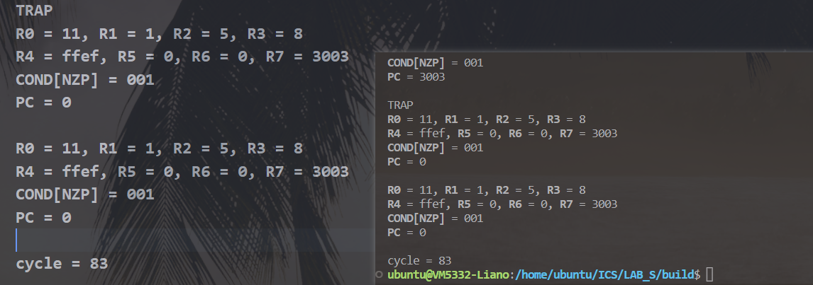

# ICS labS

学号：PB21111715									姓名：李宁							日期：2023年1月1日

## 实验目的

- 学习汇编器原理
- 复习 lc3 指令
- 学习 cpp 知识

## 实验原理

### memory

内存类主要包含以下部分：

成员变量：

- `memory`：数组模拟内存

成员函数：

- `memory_tp`：构造函数
- `ReadMemoryFromFile`：将程序文件载入内存
- `GetContent`：内存读取

##### ReadMemoryFromFile

打开文件，按行读取，保存在对应地址的内存中。代码如下：

```cpp
void memory_tp::ReadMemoryFromFile(std::string filename, int beginning_address) {
    // 打开文件
    std::string line;
    std::ifstream input_file(filename);
    if (!input_file.is_open())
    {
        std::cout << "Unable to open file" << std::endl;
        exit(-1);
    }
    // 按行读取
    while (std::getline(input_file, line))
    {
        int num = stoi(line, NULL, 2);
        memory[beginning_address++] = (int16_t)num;
    }
}
```

##### GetContent

读取给定地址的内存，直接 [] 读取即可。代码如下：

```cpp
// 读取内存
int16_t memory_tp::GetContent(int address) const {
    return memory[address];
}
// 重载[]操作符
int16_t &memory_tp::operator[](int address) {
    if (address > 0xffff) {
        // @read memory error!
        std::cout << "read memory error!" << std::endl;
        exit(-2);
    }
    else
        return memory[address];
}
```

### register

寄存器也是用数组模拟，常量索引，代码如下：

```cpp
const int kRegisterNumber = 10;
enum RegisterName {
    R_R0 = 0,
    R_R1,
    R_R2,
    R_R3,
    R_R4,
    R_R5,
    R_R6,
    R_R7,
    R_PC, // 8
    R_COND // 9
};
typedef std::array<int16_t, kRegisterNumber> register_tp;
```

然后重载了 << 运算符，便于输出寄存器信息，代码如下：

```cpp
std::ostream& operator<<(std::ostream& os, const register_tp& reg) {
    os << "\e[1mR0\e[0m = " << std::hex << reg[R_R0] << ", ";
    os << "\e[1mR1\e[0m = " << std::hex << reg[R_R1] << ", ";
    os << "\e[1mR2\e[0m = " << std::hex << reg[R_R2] << ", ";
    os << "\e[1mR3\e[0m = " << std::hex << reg[R_R3] << std::endl;
    os << "\e[1mR4\e[0m = " << std::hex << reg[R_R4] << ", ";
    os << "\e[1mR5\e[0m = " << std::hex << reg[R_R5] << ", ";
    os << "\e[1mR6\e[0m = " << std::hex << reg[R_R6] << ", ";
    os << "\e[1mR7\e[0m = " << std::hex << reg[R_R7] << std::endl;
    os << "\e[1mCOND[NZP]\e[0m = " << std::bitset<3>(reg[R_COND]) << std::endl;
    os << "\e[1mPC\e[0m = " << std::hex << reg[R_PC] << std::endl;
    return os;
}
```

### simulator

模拟器类主要包含以下部分：

成员变量：

- `reg`：寄存器
- `mem`：内存

成员函数：

- `VM_ADD`：指令执行函数
- ...
- `virtual_machine_tp`：构造函数，初始化内存，寄存器
- `UpdateCondRegister`：更新条件码
- `NextStep`：单步执行

##### SignExtend

符号位扩展函数，判断最高位，如果是 1，那么加上 `1111..000` 的掩码再返回；如果是 0，那么直接返回即可。代码如下：

```cpp
// 符号位扩展
template <typename T, unsigned B> inline T SignExtend(const T x) {
    int16_t mask = 1, ans = x;
    int tmp = B;
    while (--tmp) 
        mask *= 2;
    int flag = x & mask;
    if (flag) {
        mask *= 2;
        mask--;
        mask = ~mask;
        ans += mask;
    }
    return ans;
}
```

##### UpdateCondRegister

更新条件码，直接根据寄存器正负更新即可，代码如下：

```cpp
// 更新条件码
void virtual_machine_tp::UpdateCondRegister(int regname) {
    int16_t tmp = reg[regname];
    if (tmp == 0)
        reg[R_COND] = 0b010;
    else if (tmp > 0)
        reg[R_COND] = 0b001;
    else
        reg[R_COND] = 0b100;
}
```

##### VM_ADD

指令执行函数，这里只分析这一个，其他类似。

首先获取目的寄存器和其中一个操作寄存器，然后判断第二个操作对象，如果是立即数，那么符号位扩展，然后相加；如果是寄存器，那么直接相加即可，最后更新条件码。代码如下：

```cpp
// ADD
void virtual_machine_tp::VM_ADD(int16_t inst) {
    int flag = inst & 0b100000;
    int dr = (inst >> 9) & 0x7;
    int sr1 = (inst >> 6) & 0x7;
    // 立即数
    if (flag) {
        int16_t imm = SignExtend<int16_t, 5>(inst & 0b11111);
        reg[dr] = reg[sr1] + imm;
    }
    // 寄存器
    else {
        int sr2 = inst & 0x7;
        reg[dr] = reg[sr1] + reg[sr2];
    }
    // 更新条件码
    UpdateCondRegister(dr);
}
```

##### virtual_machine_tp

模拟器类的构造函数，首先调用 `ReadMemoryFromFile` 初始化内存，然后根据 `inputfile` 初始化寄存器，最后初始化 `PC` 和 `condition code`，代码如下：

```cpp
// 构造函数，初始化内存，寄存器
virtual_machine_tp::virtual_machine_tp(const int16_t address, const std::string &memfile, const std::string &regfile) {
    // 初始化内存
    if (memfile != "")
        mem.ReadMemoryFromFile(memfile);
    // 初始化寄存器
    std::ifstream input_file;
    input_file.open(regfile);
    if (input_file.is_open()) {
        int line_count = std::count(std::istreambuf_iterator<char>(input_file), std::istreambuf_iterator<char>(), '\n');
        input_file.close();
        input_file.open(regfile);
        if (line_count >= 8) {
            for (int index = R_R0; index <= R_R7; ++index)
                input_file >> reg[index];
        }
        else {
            for (int index = R_R0; index <= R_R7; ++index)
                reg[index] = 0;
        }
        input_file.close();
    }
    else {
        for (int index = R_R0; index <= R_R7; ++index)
            reg[index] = 0;
    }
    // 初始化 PC 和 condition code
    reg[R_PC] = address;
    reg[R_COND] = 0;
}
```

##### NextStep

单步执行函数，根据 PC 取得指令，PC 自增，然后调用相应的执行函数执行指令，函数返回当前 PC（PC=0 是程序结束标志），代码如下：

```cpp
// 单步执行
int16_t virtual_machine_tp::NextStep() {
    int16_t current_pc = reg[R_PC];
    // PC++
    reg[R_PC]++;
    // 取指令
    int16_t current_instruct = mem[current_pc];
    int opcode = (current_instruct >> 12) & 15;
    // 执行指令
    switch (opcode) {
        case O_ADD:
            if (gIsDetailedMode)
                std::cout << "ADD" << std::endl;
            VM_ADD(current_instruct);
            break;
        ...
    }
    // 返回当前 PC
    if (current_instruct == 0)
        return 0;
    return reg[R_PC];
}
```

### main

最后是主函数，初始化模拟器类，然后单步执行即可，代码主要部分如下：

```cpp
int main(int argc, char **argv) {
    virtual_machine_tp virtual_machine(gBeginningAddress, gInputFileName, gRegisterStatusFileName);
    int halt_flag = true;
    int time_flag = 0;
    while(halt_flag) {
        // Single step
        if (!virtual_machine.NextStep())
            halt_flag = false;
        if (gIsDetailedMode)
            std::cout << virtual_machine.reg << std::endl;
        ++time_flag;
    }
    std::cout << virtual_machine.reg << std::endl;
    std::cout << "cycle = " << time_flag << std::endl;
    return 0;
}
```

## 实验结果

三个测试样例结果全部符合预期，如下图所示：

